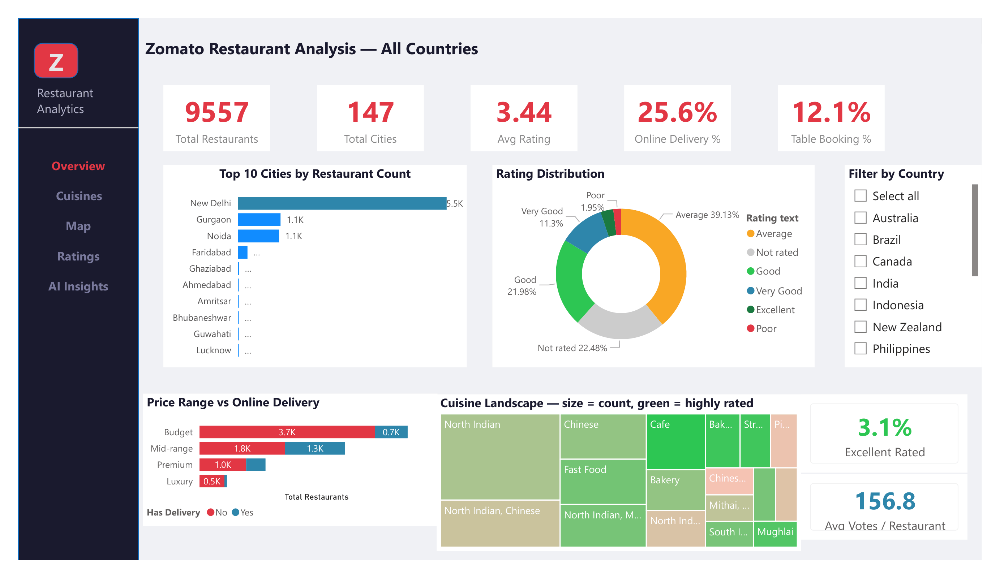
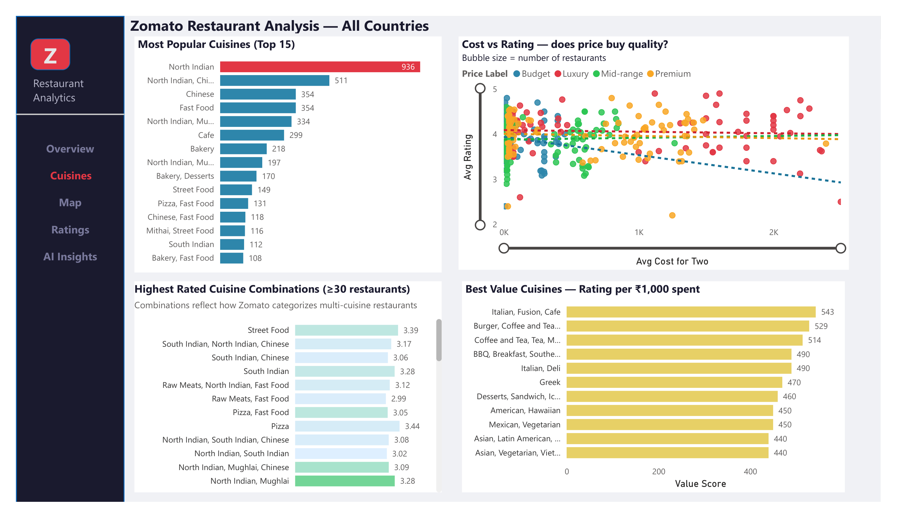
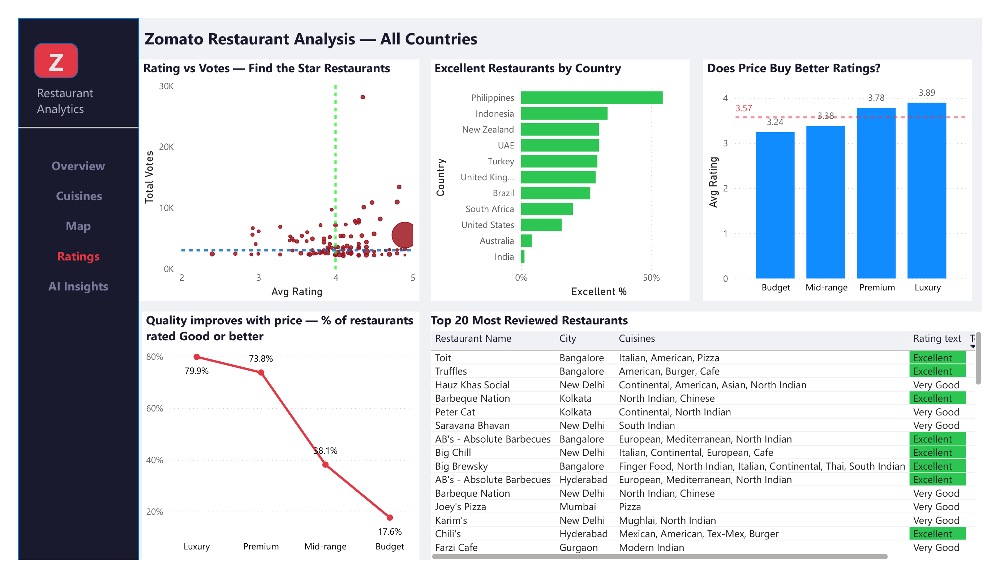

# 🍽️ Zomato Restaurant Analytics Dashboard

> **Power BI · DAX · Power Query · Python**  
> 9,557 restaurants · 15 countries · 6 interactive pages

A client-ready analytics dashboard built from scratch on the Zomato global restaurant dataset. 
Designed to answer real business questions: where are the best restaurants, what drives quality, 
and which cuisines offer the best value?

---

## 📸 Dashboard Preview

### Page 1 — Executive Overview


### Page 2 — Cuisine Analysis  


### Page 3 — Geographic Map


### Page 4 — Ratings Analysis


### Page 5 — AI Insights


### Page 3 — Custom Tooltip


---

## 🎯 Business Questions Answered

| Question | Visual |
|----------|--------|
| Which cities have the most restaurants? | Bar chart + Map |
| Does higher price mean better ratings? | Scatter with trend lines |
| Which cuisines give the best value per ₹1,000? | Value Score bar chart |
| What % of restaurants are truly Excellent? | Donut + KPI cards |
| What factors predict high ratings? | AI Key Influencers |

---

## 🔑 Original Metrics Built

- **Value Score** = Avg Rating ÷ (Avg Cost / 1000) — rates quality per rupee spent
- **Excellent %** = % of restaurants rated Excellent per country
- **Avg Votes per Restaurant** — measures engagement depth by market

---

## 🛠️ Technical Stack

| Layer | Tools |
|-------|-------|
| Data cleaning | Power Query, Python |
| Measures | DAX (CALCULATE, DIVIDE, SELECTEDVALUE) |
| Visualizations | Power BI Desktop |
| AI analytics | Key Influencers, Decomposition Tree |
| Publishing | Power BI Service |

---

## 📊 Dashboard Pages

1. **Executive Overview** — KPI cards, Top 10 cities, Rating donut, Cuisine treemap
2. **Cuisine Analysis** — Scatter with trend lines, Value Score, Highest rated
3. **Geographic Map** — City bubbles colored by rating, custom tooltip on hover
4. **Rating Deep Dive** — Star restaurant finder, quality line chart, top 20 table
5. **AI Insights** — Key Influencers + Decomposition Tree
6. **Custom Tooltip** — Dark-themed popup showing city stats on map hover

---

## 📁 Repository Structure

```
Zomato-Restaurant-Analytics-Dashboard/
├── data/
│   └── zomato.csv
├── pbix/
│   └── Zomato_restaurants_analysis.pbix
├── visuals/
│   ├── overview.png
│   ├── cuisines.png
│   ├── map.png
│   ├── ratings.png
│   └── ai_insights.png
└── README.md
```

---

## 🔗 Links

- 💼 Book a free 30-mins Data Audit Call: [cal.com/free_30-min_data_audit_call](https://cal.com/vijaivarma/free-30-min-data-audit-call)
- 🌐 Portfolio: [vijaivarma.github.io/Portfolio](https://vijaivarma.github.io/Portfolio)
- 💼 LinkedIn: [linkedin.com/in/vijaivarmadataanalyst](https://linkedin.com/in/vijaivarmadataanalyst)
